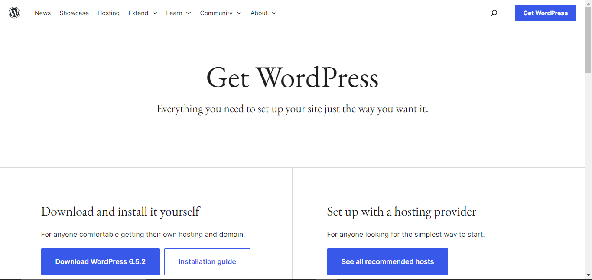
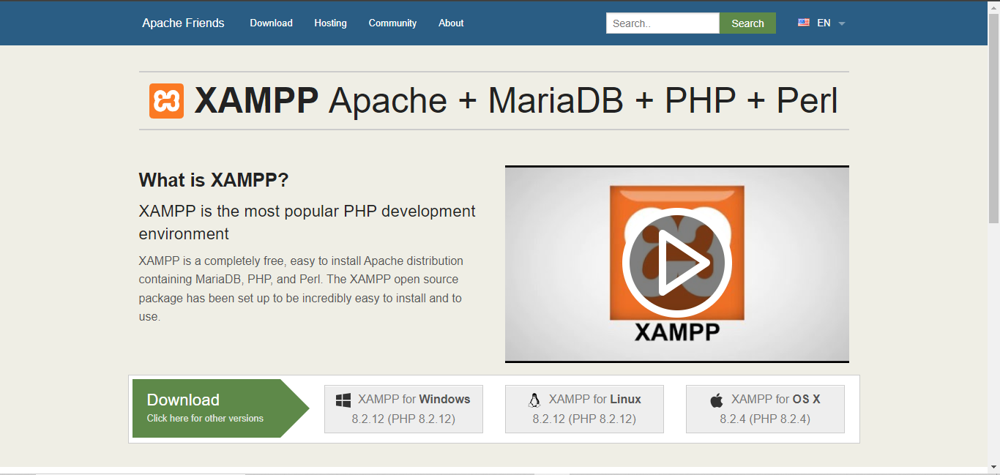
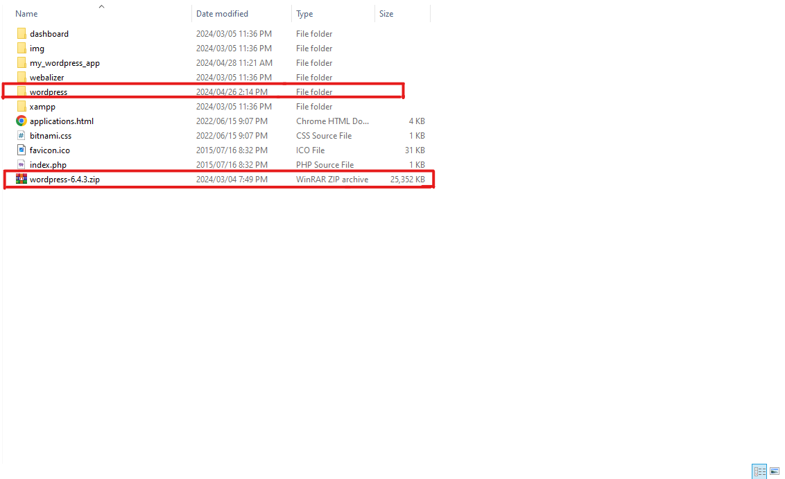
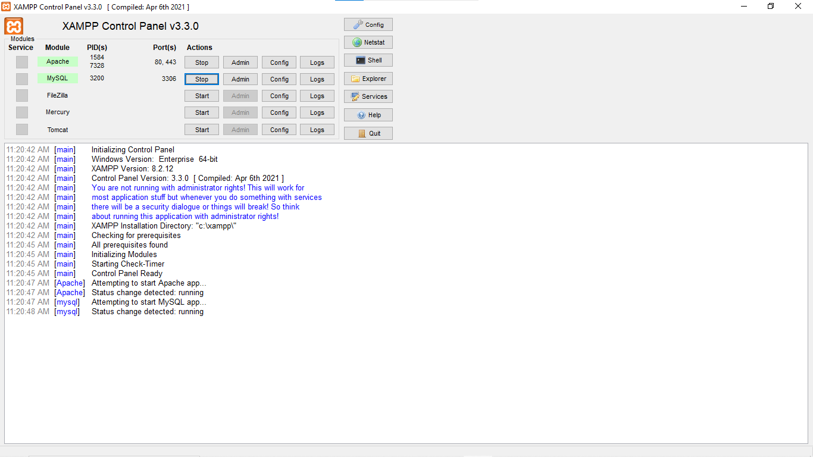
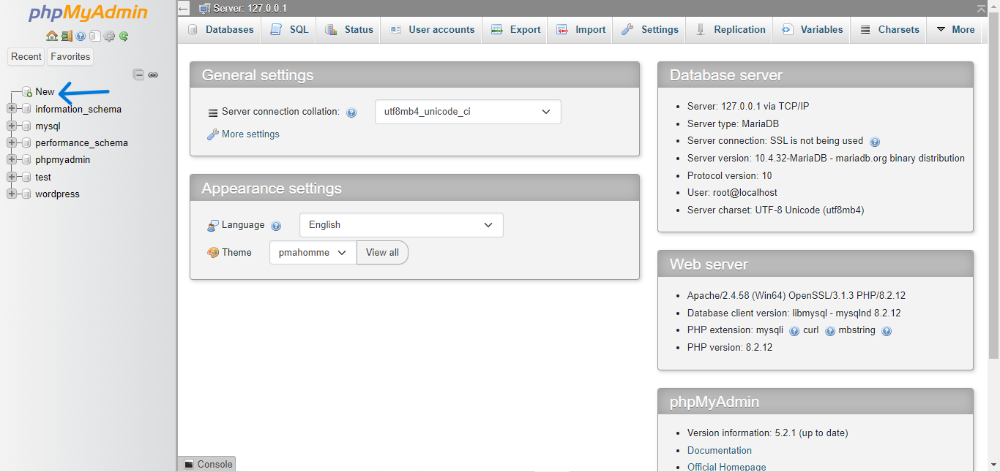
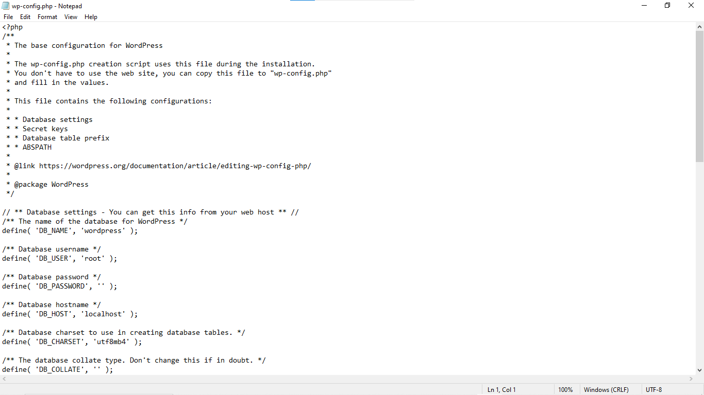
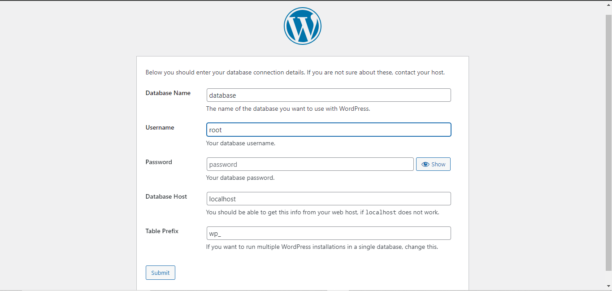
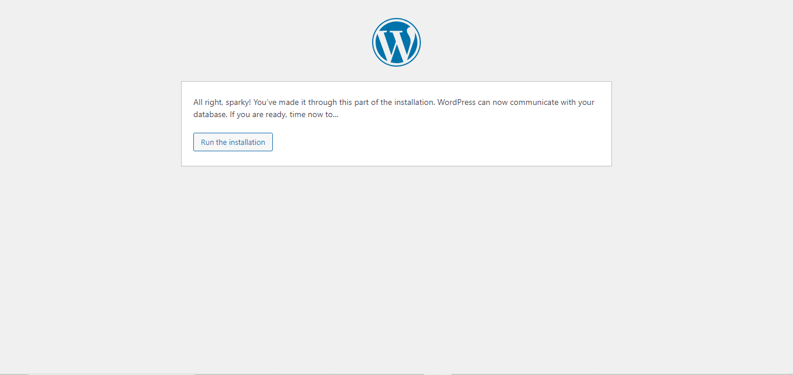
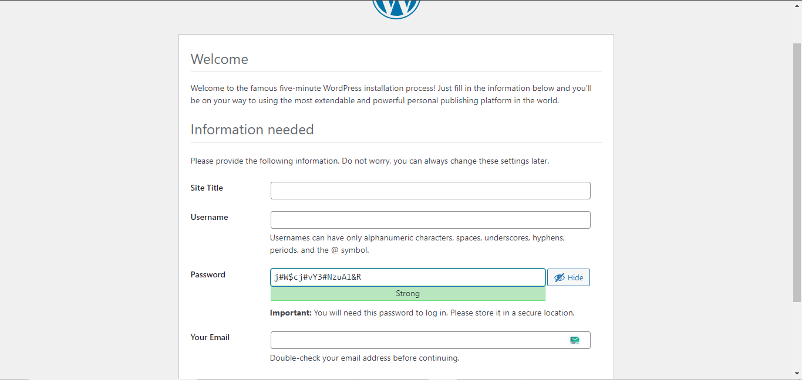

|        Name         |         Amad Irfan         |
| :-----------------: | :------------------------: |
| **Registration No** |       **2021-CS-25**       |
|   **Assignment**    | **WordPress Installation** |

#WordPress Installation:

----------------------------------------------------------------------------------------------------------------------------------------------------------------

**This guide will cover the manual installation process.**

**Manual Installation Steps:**

1. **Download WordPress:** Visit <https://wordpress.org/download/> and download the latest version of `WordPress`.

   ​

   

   ​

2. **Download XAMPP:**after downloading WordPress visit URL <https://www.apachefriends.org/> to download latest version of `XAMPP`.

   ​

   

   ​

3. **Extract the Files:**  Extract the downloaded zip file to your computer in `C:\xampp\htdocs` directory. This will create a folder containing all the WordPress files.

   ​

   

   ​

4. **Run XAMPP Server :** to run WordPress open `XAMPP control panel` and start `apache` and `MYSQL`.

   ​

5. 

   ​

6. **Create a Database:**  You'll need a MySQL database to store your website's content. open `phpMyAdmin` to create database in `MYSQL`. [http://localhost/phpmyadmin](http://localhost/phpmyadmin) Use this URL to create a new database and a database user with appropriate permissions in MYSQL locally. just go to your browser and put the above URL in search bar to open MYSQL admin panel.

   ​

   

   ​

   click on `new` button to create database.

   ​

7. **Configure wp-config.php:**  Locate the `wp-config.php` file within the uploaded WordPress folder on your server in `htdocs` directory in `C:\xampp\htdocs\wordpress` directory. Open this file in a text editor and edit the following details:

   - **Database Name:** Replace the placeholder with the name of the database you created.

   - **Database User:** Replace the placeholder with the username for your database user.

   - **Database Password:** Replace the placeholder with the password for your database user.

   - **Database Host:** This is usually "localhost" unless your hosting provider specifies differently.

     ​

     

     ​

     on the other way just go to web and run `localhost\wordpress` ant then configuration setting open here before installation of WordPress.

     ​

     

     ​

     here you can configure your `wp-config` file.

8. **Run the Installation:**  now just click on `run the installation`button to complete installation. 

   ​

   

   ​

9. **Complete the Installation:**  Follow the on-screen instructions to complete the installation. You'll provide your website title, username, password, and email address.

   ​

   

   ​	

   **Note :** Remember you `username` and `password` to login in your `WordPress admin penal`  

   ​

10. **Using WordPress:**

Once the installation is complete, you can access your WordPress administration panel (dashboard) by visiting . Here, you can manage your website content, customize its appearance with themes, and add functionalities with plugins.