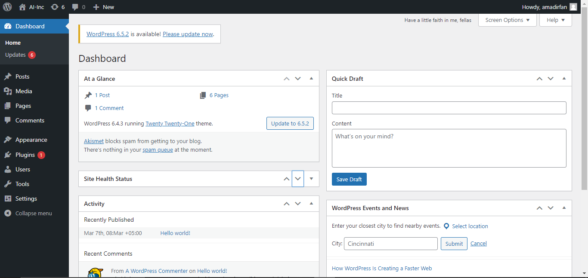
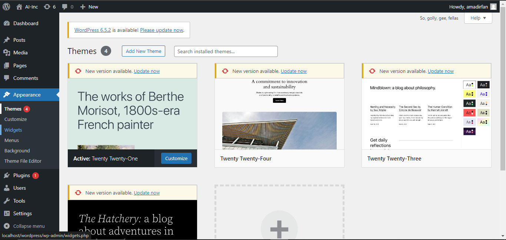
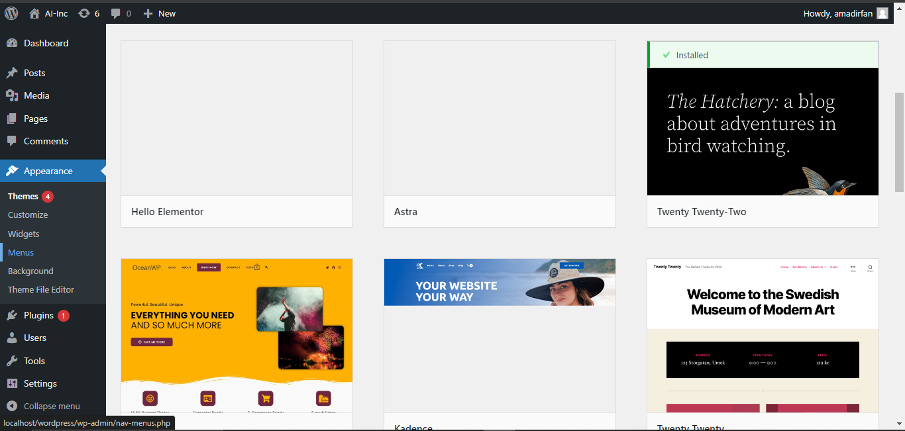
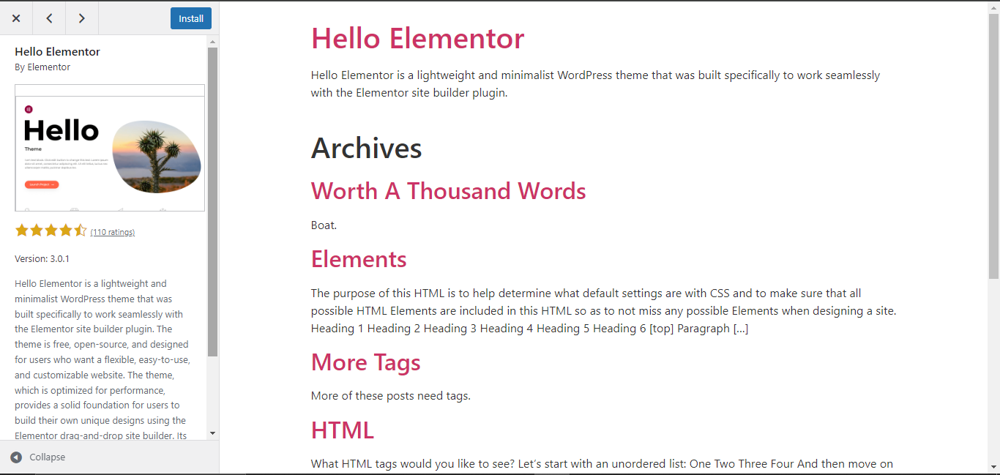
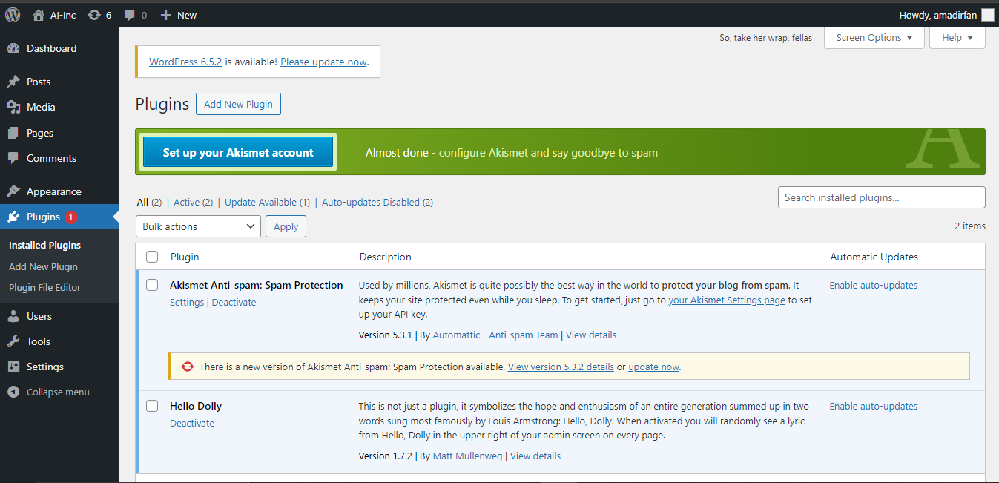
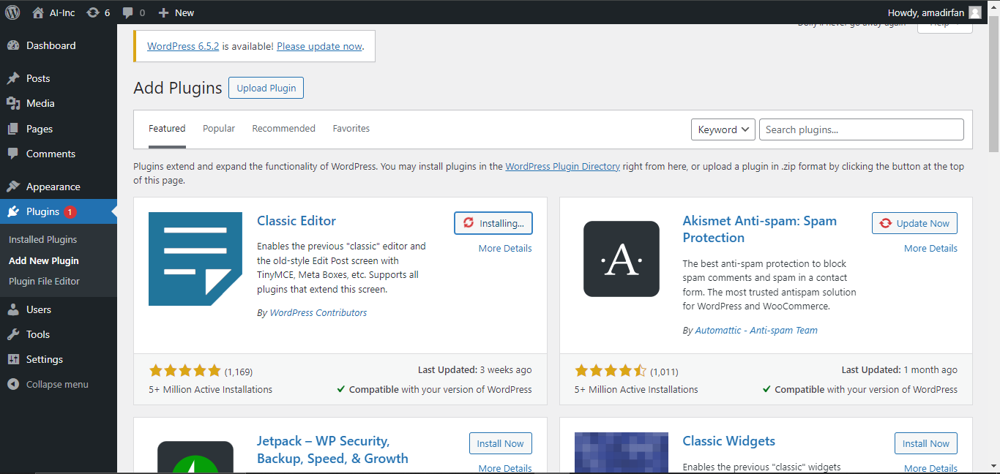
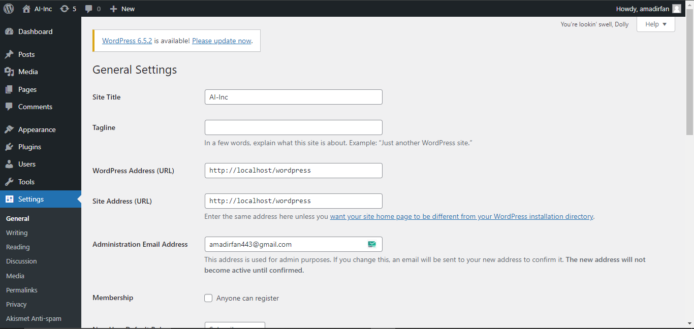
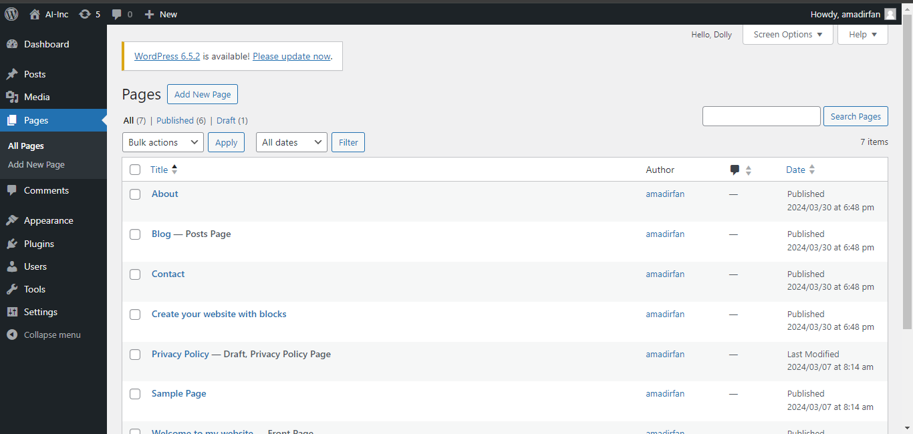
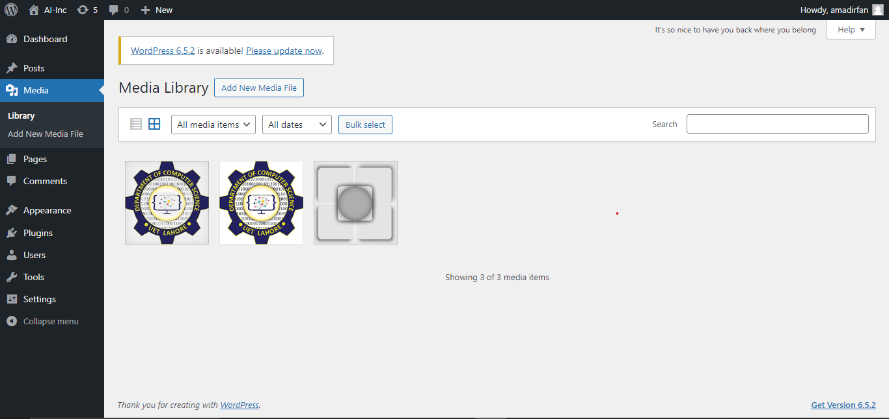

| Name            | Amad Irfan |
| --------------- | ---------- |
| Registration No | 2021-CS-25 |
| Assignment      | WordPress  |

# WordPress

----------------------------------------------------------------------------------------------------------------------------------------------------------------

**Dashboard :**

To access the dashboard of `WordPress` from dashboard you can manage all of your website content. here is the picture of Dashboard. open your browser and use URL   [wordpress-admin penal](http://localhost/wordpress/wp-admin) 

**Installing a Theme from the WordPress Directory**

1. **Login to your WordPress dashboard.**
2. Navigate to **Appearance** > **Themes**.
3. You'll see the installed themes and a button "Add New Theme" at the top. Click it.
4. Now you're in the WordPress theme directory. Browse the free themes or use the search and filter options to find a theme that suits your needs.
5. Once you find a theme you like, hover over it and click **Install**.
6. After installation, you can choose to **Activate** the theme right away or click "View Details" for more information.

**Method 2: Uploading a Theme Manually (For Premium Themes or Downloaded Themes)**

1. **Download the theme file.** This will usually be a ZIP file.
2. In your WordPress dashboard, go to **Appearance** > **Themes**.
3. Click **Add New** at the top.
4. Click **Upload Theme**.
5. Click **Choose File** and select the downloaded theme ZIP file from your computer.
6. Click **Install Now**.

**Themes Page:**

Click on install button to install theme.

**Installing a Plugin from the WordPress Dashboard :**

1. **Navigate to the Plugins Menu:**

   ​	In your WordPress dashboard, go to the "Plugins" menu on the left sidebar.

2. **Search or Browse for Plugins:**

   ​	You can either search for a specific plugin by name in the search bar at the top right, or browse the featured or popular plugins.

3. **Install and Activate:** 

   ​	Once you've found the desired plugin, click "Install Now" next to it. After installation, click "Activate" to make the plugin functional on your website.

   ​

   

   ​

   **Plugin installation page :**

   ​

   

   ​

   **Activating and Deactivating Plugins in WordPress**

   Managing plugins is a crucial part of maintaining your WordPress website. Here's a guide on how to activate and deactivate plugins with screenshots.

   ​

   **Activating a Plugin:**

   1. **Navigate to Plugins Menu:** In WordPress dashboard, go to the "Plugins" menu on the left sidebar.
   2. **Find the Plugin:** You'll see a list of all installed plugins, both active and inactive. Locate the plugin you want to activate.
   3. **Activate the Plugin:**

   - **Single Plugin:** If you want to activate a single plugin, click the "Activate" link next to its name.

   - **Multiple Plugins:** To activate multiple plugins at once, tick the checkbox next to each plugin you want to activate. Then, from the "Bulk Actions" dropdown menu at the top, select "Activate" and click "Apply."

     ​

   **Deactivating a Plugin:**

   ​

   1. **Navigate to Plugins Menu:** Similar to activating plugins, start by going to the "Plugins" menu on your WordPress dashboard sidebar.
   2. **Find the Plugin:** Locate the plugin you want to deactivate in the list.
   3. **Deactivate the Plugin:**

   - **Single Plugin:** Click the "Deactivate" link next to the plugin's name.
     Image of WordPress Plugin with Deactivate link highlighted: search for "WordPress Plugin with Deactivate link highlighted image" online
   - **Multiple Plugins:** For deactivating multiple plugins, select the checkboxes next to the desired plugins. Then, from the "Bulk Actions" dropdown menu, choose "Deactivate" and click "Apply."

   Deactivating a plugin won't delete it. The plugin will remain on your website but won't be functional.

   If you're unsure about the consequences of deactivating a plugin, it's best to create a backup of your website before proceeding.

   ​

   **WordPress Setting :**

   ​

   WordPress offers a variety of settings to personalize your website's functionality and appearance.

   **1. Accessing the Settings Menu:**

   - In your WordPress dashboard, locate the **Settings** menu on the left sidebar. It's usually near the bottom.
   - Clicking on **Settings** will reveal a submenu with various options for configuring different aspects of your website.

   **2. Settings and Customization Options:**

   Here are some frequently used settings sections and what you can adjust within them:

   - **General:**  Define your website's title, tagline, URL structure (permalinks), date and time format, and more.
   - **Writing:** Set default categories and post formats for your blog posts.
   - **Reading:** Control what visitors see on your homepage, how many posts display per page, and whether comments are enabled.
   - **Discussion:** Manage comment moderation settings, spam filtering, and avatar display options.
   - **Permalinks:** Choose how your website's URLs are structured. You can have them include the post date or title, or create a custom format.
   - **Media:** Specify default image sizes for different purposes on your website.

   **3. Making Changes and Saving:**

   - Each settings section has various options you can modify. Click on checkboxes, radio buttons, or dropdown menus to choose your preferences.
   - You can also enter text in designated fields for settings like your website title or email address.
   - Once you've made your changes, remember to click the **Save Changes** button at the bottom of the page for them to take effect.

   - Some themes or plugins might add their own settings options within the main Settings menu.

     ​

   

 **Adding Pages in WordPress:**

   WordPress pages are ideal for static content on your website, such as "About Us," "Contact," or "Services." Here's how to add new pages with ease:

   **1. Accessing the Pages Menu:**

   - In your WordPress dashboard, locate the **Pages** menu on the left sidebar. It's under the `Media` menu.

   2.**Creating a New Page:**

   There are two ways to create a new page.

   - **Option 1:** Click the **Add New** button at the top of the Pages menu

   - **Option 2:** Hover your mouse over the **Pages** menu and select **Add New**.

   **3. Building Your Page Content:**

 - You'll be directed to the WordPress editor for creating your new page.

 - Here, you can add a title for your page at the top. This title will be displayed on your website's navigation menu.

 - The editor uses a block system. Click the "+" icon and choose different blocks to add content like text paragraphs, headings, images, videos, buttons, and more.

 - You can drag and drop blocks to rearrange their order on the page.

 - Click on any block to edit its content, formatting, and style.

 **4. Setting Visibility and Publish:** 

 - On the right-hand side of the editor, you'll find the **Publish** meta box.
 - Under **Visibility**, you can choose whether to publish the page immediately, schedule it for a future date, or keep it as a draft.
- Click the **Publish** button to make your new page live on your website.

**5. Adding a Page to Your Menu:**

- Once your page is published, it won't be automatically visible on your website's navigation menu.

- To add it to the menu, navigate to **Appearance** > **Menus** in your dashboard sidebar.

- Create a new menu or select an existing one where you want to add the page.

  In the menu items section, check the box next to your newly created page and click **Add to Menu**.

  Finally, click the **Save Menu** button to make the changes visible on your website.

  

  ​

**6. Uploading Media:**

- There are two primary ways to upload media files (images, videos, documents) to your WordPress website:
   1. **From the Media Library:** Go to **Media** > **Add New** in your WordPress dashboard sidebar. Click "Select Files" and choose the files from your computer. You can also drag and drop files directly into the upload area.
   2. **While Creating Content:** When editing posts or pages, click on the "Add Media" button in the block editor. You can then upload files directly or choose them from your existing media library.

**Organizing Your Media Library:**

- By default, uploaded media gets categorized by date. This can become overwhelming as your media library grows. Here are ways to improve organization:
    - **Folders (Requires Plugin):** Plugins like "Real Media Library" or "WP Media Folder" allow you to create folders and subfolders within your media library for categorized storage.
    - **Tags:** Add relevant tags to your media files during upload or while editing them in the Media Library. This enables searching for specific media using tags.
    - **Captions and Descriptions:** Utilize captions and descriptions when uploading media. These provide context and can be helpful for SEO.

**Editing Media Files:**

- WordPress allows basic editing for images directly within the Media Library:
    - **Cropping and Resizing:** Click the "Edit Image" link beneath a media file to access cropping and resizing tools.

    - **Alt Text:** Edit the "Alternative Text" field to provide a text description of the image for accessibility and SEO.

    - **Captions and Titles:** You can also edit captions and titles for your media files within this section.

      